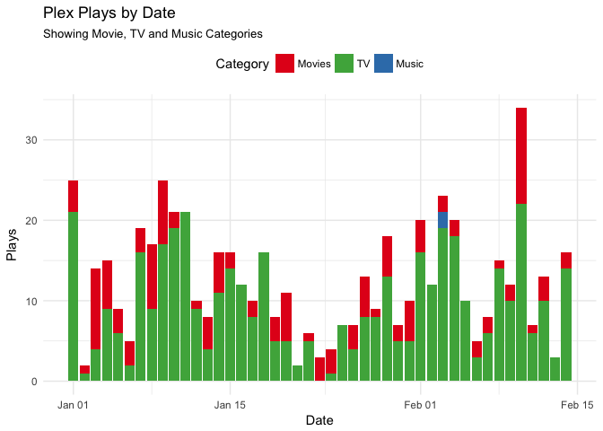
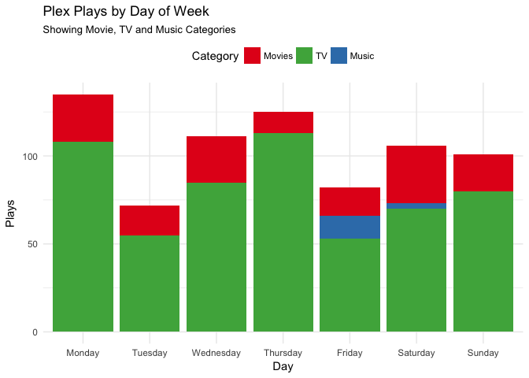
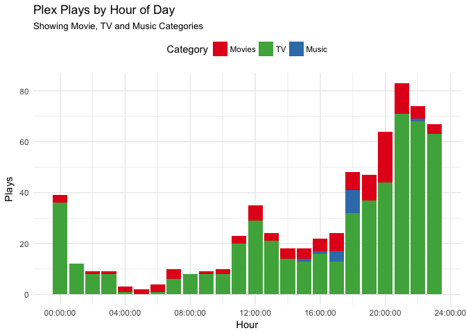

<!-- README.md is generated from README.Rmd. Please edit that file -->

# tauturri

<!-- badges: start -->

[](https://github.com/jemus42/tauturri/actions/workflows/R-CMD-check.yaml)
[](https://codecov.io/github/jemus42/tauturri?branch=master)
[](https://cran.r-project.org/package=tauturri)
[](https://cran.r-project.org/package=tauturri)
[](https://www.tidyverse.org/lifecycle/#maturing)
<!-- badges: end -->

The goal of `tauturri` is to get data out of
[**Tautulli**](https://github.com/Tautulli/Tautulli) (formerly
**PlexPy**) as simply as possible.

The project is still pretty young, and while it’s reasonably functional,
there might still be some issues. At least it passes all the tests, I
guess?

## Installation

Current stable version on CRAN:

``` r
install.packages("tauturri")
```

Current development version on GitHub:

``` r
if (!("remotes" %in% installed.packages())){
  install.packages("remotes")
}

remotes::install_github("jemus42/tauturri")
```

## Setup

To use this package, you’ll need a working instance of
[Tautulli](http://tautulli.com/), enable the API and store the URL and
your API key.

In your `~/.Renviron`, set the following:

    # Tautulli
    tautulli_url=<Tautulli URL (with port, if necessary)>
    tautulli_apikey=<Tautilli API key>

That’s it.  
Alternatively use `Sys.setenv()` to set the appropriate values in a
script.

## Server Info

``` r
info <- get_servers_info()

# Probably shouldn't show URL etc.
names(info)
#> [1] "name"               "machine_identifier" "host"              
#> [4] "port"               "version"
info[c("name", "version")]
#> # A tibble: 1 × 2
#>   name  version              
#>   <chr> <chr>                
#> 1 PPTH  1.28.2.6151-914ddd2b3
```

## `get_plays_by` \[date\|dayofweek\|…\]

All plays in the current year, per day:

``` r
plays <- get_plays_by_date(time_range = lubridate::yday(lubridate::now()))

plays |>
  gather(category, playcount, TV, Movies, Music) |>
  ggplot(aes(x = date, y = playcount, fill = category)) +
  geom_col() +
  scale_fill_brewer(
    palette = "Set1",
    breaks = c("Movies", "TV", "Music")
  ) +
  labs(
    title = "Plex Plays by Date",
    subtitle = "Showing Movie, TV and Music Categories",
    x = "Date", y = "Plays", fill = "Category"
  ) +
  theme_minimal() +
  theme(legend.position = "top")
```



… per day of week:

``` r
plays <- get_plays_by_dayofweek(time_range = lubridate::yday(lubridate::now()))

plays |>
  gather(category, playcount, TV, Movies, Music) |>
  ggplot(aes(x = day, y = playcount, fill = category)) +
  geom_col() +
  scale_fill_brewer(
    palette = "Set1",
    breaks = c("Movies", "TV", "Music")
  ) +
  labs(
    title = "Plex Plays by Day of Week",
    subtitle = "Showing Movie, TV and Music Categories",
    x = "Day", y = "Plays", fill = "Category"
  ) +
  theme_minimal() +
  theme(legend.position = "top")
```



… and per hour of day:

``` r
plays <- get_plays_by_hourofday(time_range = lubridate::yday(lubridate::now()))

plays |>
  gather(category, playcount, TV, Movies, Music) |>
  ggplot(aes(x = hms::hms(hours = hour), y = playcount, fill = category)) +
  geom_col() +
  scale_fill_brewer(
    palette = "Set1",
    breaks = c("Movies", "TV", "Music")
  ) +
  labs(
    title = "Plex Plays by Hour of Day",
    subtitle = "Showing Movie, TV and Music Categories",
    x = "Hour", y = "Plays", fill = "Category"
  ) +
  theme_minimal() +
  theme(legend.position = "top")
```



## API Functions Not Yet Implemented

``` r
api_functions <- names(api_request(cmd = "docs")$data)
api_functions <- api_functions[grepl("^get_", api_functions)]
sort(api_functions[!(api_functions %in% getNamespaceExports("tauturri"))])
#>  [1] "get_apikey"                "get_children_metadata"    
#>  [3] "get_collections_table"     "get_date_formats"         
#>  [5] "get_export_fields"         "get_exports_table"        
#>  [7] "get_geoip_lookup"          "get_item_user_stats"      
#>  [9] "get_item_watch_time_stats" "get_logs"                 
#> [11] "get_metadata"              "get_new_rating_keys"      
#> [13] "get_newsletter_config"     "get_newsletter_log"       
#> [15] "get_newsletters"           "get_notification_log"     
#> [17] "get_notifier_config"       "get_notifier_parameters"  
#> [19] "get_notifiers"             "get_old_rating_keys"      
#> [21] "get_playlists_table"       "get_plex_log"             
#> [23] "get_server_info"           "get_server_pref"          
#> [25] "get_settings"              "get_stream_data"          
#> [27] "get_synced_items"          "get_tautulli_info"        
#> [29] "get_user"                  "get_whois_lookup"
```

## CoC

Please note that this project is released with a [Contributor Code of
Conduct](CODE_OF_CONDUCT.md).  
By participating in this project you agree to abide by its terms.
