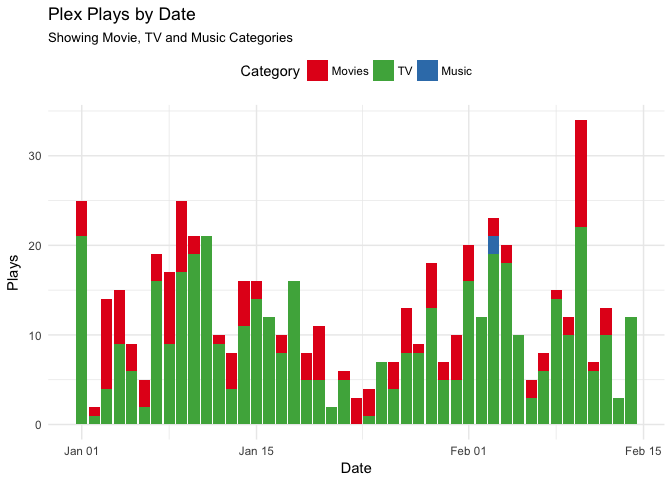

<!-- README.md is generated from README.Rmd. Please edit that file -->
tauturri
========

[](https://travis-ci.org/jemus42/tauturri) [](https://codecov.io/github/jemus42/tauturri?branch=master)

The goal of `tauturri` is to get data out of [**Tautulli**](https://github.com/JonnyWong16/plexpy) (formerly **PlexPy**) as simply as possible.

The project is in the initial setup phase. Nothing works yet.

Server Info
-----------

``` r
info <- get_servers_info()
names(info)
#> [1] "port"               "host"               "version"           
#> [4] "name"               "machine_identifier"
# Probably shouldn't show URL etc.
info[c("name", "version")]
#>   name               version
#> 1 PPTH 1.11.2.4772-3e88ad3ba
```

`get_plays_by`
--------------

``` r
plays <- get_plays_by_date()

plays %>% 
  gather(category, playcount, tv, movies, music) %>%
  ggplot(data = ., aes(x = date, y = playcount, fill = category)) +
  geom_col() +
  scale_fill_brewer(palette = "Set1") +
  labs(title = "Plex Plays by Date",
       subtitle = "Showing Movie, TV and Music Categories",
       x = "Date", y = "Plays", fill = "Category") +
  theme_minimal() +
  theme(legend.position = "top")
```



CoC
---

Please note that this project is released with a [Contributor Code of Conduct](CODE_OF_CONDUCT.md).
By participating in this project you agree to abide by its terms.
