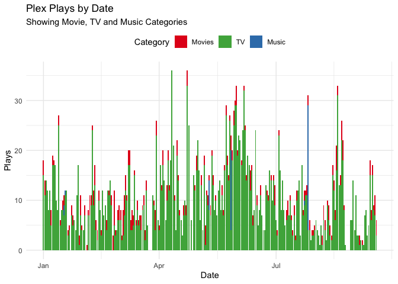
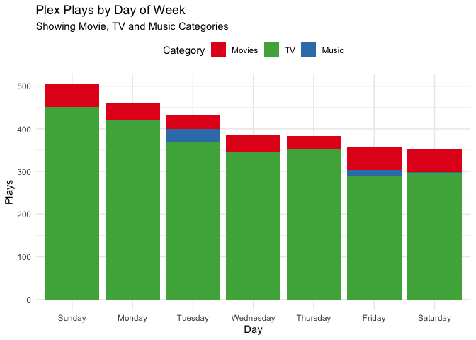

<!-- README.md is generated from README.Rmd. Please edit that file -->
tauturri
========

[](https://travis-ci.org/jemus42/tauturri) [](https://codecov.io/github/jemus42/tauturri?branch=master) [](https://cran.r-project.org/package=tauturri)

The goal of `tauturri` is to get data out of [**Tautulli**](https://github.com/Tautulli/Tautulli) (formerly **PlexPy**) as simply as possible.

The project is in the initial setup phase.
Dragons and such, they be there.

Installation
------------

Do not expect this to make it to CRAN anytime soon.

``` r
if (!("remotes" %in% installed.packages())){
  install.packages("remotes")
}

remotes::install_github("jemus42/tauturri")
```

Setup
-----

In your `~/.Renviron`, set the following:

    # Tautulli
    tautulli_url=<Tautulli URL (with port)>
    tautulli_apikey=<Tautilli API key>

That's it.
Alternatively use `Sys.setenv()` to set the appropriate values in a script.

Server Info
-----------

``` r
info <- get_servers_info()
names(info)
#> [1] "port"               "host"               "version"           
#> [4] "name"               "machine_identifier"
# Probably shouldn't show URL etc.
info[c("name", "version")]
#> # A tibble: 1 x 2
#>   name  version              
#>   <chr> <chr>                
#> 1 PPTH  1.11.3.4803-c40bba82e
```

`get_plays_by` \[date|dayofweek|...\]
-------------------------------------

All plays in the current year, per day:

``` r
plays <- get_plays_by_date(time_range = lubridate::yday(lubridate::now()))

plays %>% 
  gather(category, playcount, TV, Movies, Music) %>%
  ggplot(aes(x = date, y = playcount, fill = category)) +
  geom_col() +
  scale_fill_brewer(palette = "Set1", 
                    breaks = c("Movies", "TV", "Music")) +
  labs(title = "Plex Plays by Date",
       subtitle = "Showing Movie, TV and Music Categories",
       x = "Date", y = "Plays", fill = "Category") +
  theme_minimal() +
  theme(legend.position = "top")
```



... per day of week:

``` r
plays <- get_plays_by_dayofweek(time_range = lubridate::yday(lubridate::now()))

plays %>% 
  gather(category, playcount, TV, Movies, Music) %>%
  ggplot(aes(x = day, y = playcount, fill = category)) +
  geom_col() +
  scale_fill_brewer(palette = "Set1", 
                    breaks = c("Movies", "TV", "Music")) +
  labs(title = "Plex Plays by Day of Week",
       subtitle = "Showing Movie, TV and Music Categories",
       x = "Day", y = "Plays", fill = "Category") +
  theme_minimal() +
  theme(legend.position = "top")
```



... and per hour of day:

``` r
plays <- get_plays_by_hourofday(time_range = lubridate::yday(lubridate::now()))

plays %>% 
  gather(category, playcount, TV, Movies, Music) %>%
  ggplot(aes(x = hms::hms(hours = hour), y = playcount, fill = category)) +
  geom_col() +
  scale_fill_brewer(palette = "Set1", 
                    breaks = c("Movies", "TV", "Music")) +
  labs(title = "Plex Plays by Hour of Day",
       subtitle = "Showing Movie, TV and Music Categories",
       x = "Hour", y = "Plays", fill = "Category") +
  theme_minimal() +
  theme(legend.position = "top")
```


API Functions Not Yet Implemented
---------------------------------

``` r
api_functions <- names(api_request(cmd = "docs")$data)
api_functions <- api_functions[grepl("^get_", api_functions)]
sort(api_functions[!(api_functions %in% getNamespaceExports("tauturri"))])
#>  [1] "get_apikey"                         
#>  [2] "get_date_formats"                   
#>  [3] "get_geoip_lookup"                   
#>  [4] "get_home_stats"                     
#>  [5] "get_libraries"                      
#>  [6] "get_libraries_table"                
#>  [7] "get_library"                        
#>  [8] "get_library_user_stats"             
#>  [9] "get_logs"                           
#> [10] "get_metadata"                       
#> [11] "get_new_rating_keys"                
#> [12] "get_notification_log"               
#> [13] "get_notifier_config"                
#> [14] "get_notifier_parameters"            
#> [15] "get_notifiers"                      
#> [16] "get_old_rating_keys"                
#> [17] "get_plays_by_stream_type"           
#> [18] "get_plex_log"                       
#> [19] "get_pms_token"                      
#> [20] "get_pms_update"                     
#> [21] "get_recently_added"                 
#> [22] "get_server_friendly_name"           
#> [23] "get_server_id"                      
#> [24] "get_server_pref"                    
#> [25] "get_settings"                       
#> [26] "get_stream_type_by_top_10_platforms"
#> [27] "get_stream_type_by_top_10_users"    
#> [28] "get_synced_items"                   
#> [29] "get_user"                           
#> [30] "get_user_ips"                       
#> [31] "get_user_logins"                    
#> [32] "get_whois_lookup"
```

CoC
---

Please note that this project is released with a [Contributor Code of Conduct](CODE_OF_CONDUCT.md).
By participating in this project you agree to abide by its terms.
