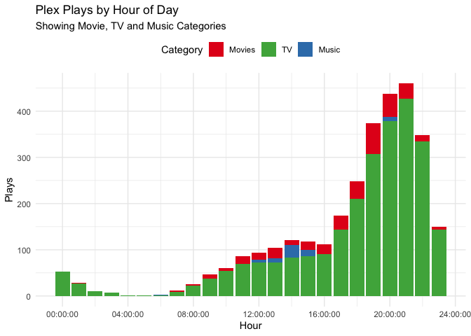

<!-- README.md is generated from README.Rmd. Please edit that file -->
tauturri
========

[](https://travis-ci.org/jemus42/tauturri) [](https://codecov.io/github/jemus42/tauturri?branch=master)

The goal of `tauturri` is to get data out of [**Tautulli**](https://github.com/Tautulli/Tautulli) (formerly **PlexPy**) as simply as possible.

The project is in the initial setup phase.
Dragons and such, they be there.

Installation
------------

Do not expect this to make it to CRAN anytime soon.

``` r
if (!("remotes" %in% installed.packages())){
  install.packages("remotes")
}

remotes::install_github("jemus42/tauturri")
```

Setup
-----

In your `~/.Renviron`, set the following:

    # Tautulli
    tautulli_url=<Tautulli URL (with port)>
    tautulli_apikey=<Tautilli API key>

That's it.
Alternatively use `Sys.setenv()` to set the appropriate values in a script.

Server Info
-----------

``` r
info <- get_servers_info()
names(info)
#> [1] "port"               "host"               "version"           
#> [4] "name"               "machine_identifier"
# Probably shouldn't show URL etc.
info[c("name", "version")]
#>   name               version
#> 1 PPTH 1.11.3.4793-482972920
```

`get_plays_by` \[date|dayofweek|...\]
-------------------------------------

All plays in the current year, per day:

``` r
plays <- get_plays_by_date(time_range = lubridate::yday(lubridate::now()))

plays %>% 
  gather(category, playcount, TV, Movies, Music) %>%
  ggplot(aes(x = date, y = playcount, fill = category)) +
  geom_col() +
  scale_fill_brewer(palette = "Set1", 
                    breaks = c("Movies", "TV", "Music")) +
  labs(title = "Plex Plays by Date",
       subtitle = "Showing Movie, TV and Music Categories",
       x = "Date", y = "Plays", fill = "Category") +
  theme_minimal() +
  theme(legend.position = "top")
```


... per day of week:

``` r
plays <- get_plays_by_dayofweek(time_range = lubridate::yday(lubridate::now()))

plays %>% 
  gather(category, playcount, TV, Movies, Music) %>%
  ggplot(aes(x = day, y = playcount, fill = category)) +
  geom_col() +
  scale_fill_brewer(palette = "Set1", 
                    breaks = c("Movies", "TV", "Music")) +
  labs(title = "Plex Plays by Day of Week",
       subtitle = "Showing Movie, TV and Music Categories",
       x = "Day", y = "Plays", fill = "Category") +
  theme_minimal() +
  theme(legend.position = "top")
```


... and per hour of day:

``` r
plays <- get_plays_by_hourofday(time_range = lubridate::yday(lubridate::now()))

plays %>% 
  gather(category, playcount, TV, Movies, Music) %>%
  ggplot(aes(x = hms::hms(hours = hour), y = playcount, fill = category)) +
  geom_col() +
  scale_fill_brewer(palette = "Set1", 
                    breaks = c("Movies", "TV", "Music")) +
  labs(title = "Plex Plays by Hour of Day",
       subtitle = "Showing Movie, TV and Music Categories",
       x = "Hour", y = "Plays", fill = "Category") +
  theme_minimal() +
  theme(legend.position = "top")
```



CoC
---

Please note that this project is released with a [Contributor Code of Conduct](CODE_OF_CONDUCT.md).
By participating in this project you agree to abide by its terms.
